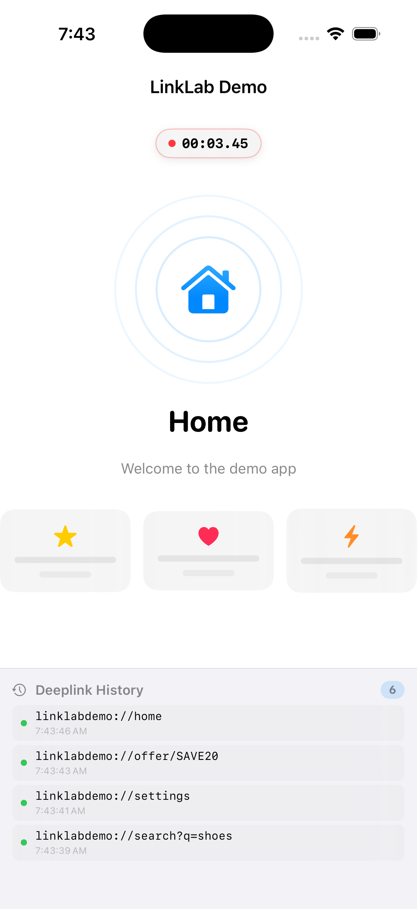

# LinkLab Demo App

A sample iOS app built to demonstrate and test deeplink handling with [**LinkLab**](https://github.com/mgsulaiman/LinkLab) — the macOS menu bar app for iOS developers to test deeplinks on the Simulator.

<p align="center">
  
</p>

<p align="center">
  
</p>

---

## What is this?

This demo app registers a custom URL scheme (`linklabdemo://`) and routes incoming deeplinks to different screens with animated transitions. Use it alongside **LinkLab** to see how deeplink testing works end-to-end on the iOS Simulator.

### Supported Deeplinks

| Deeplink | Screen | Description |
|----------|--------|-------------|
| `linklabdemo://home` | Home | Landing screen with animated cards |
| `linklabdemo://profile/user42` | Profile | User profile with stats |
| `linklabdemo://product/123` | Product | Product detail with pricing |
| `linklabdemo://search?q=shoes` | Search | Search results with query |
| `linklabdemo://settings` | Settings | App settings list |
| `linklabdemo://offer/SAVE20` | Offer | Promo screen with confetti |

### Example Push Notifications

The demo app also supports push notification testing via LinkLab's Push Notifications tab. When a notification is sent, it appears in the app's Notification History log.

| Notification | Description |
|-------------|-------------|
| Welcome Push | Basic alert with title, body, and badge |
| Push with Deeplink | Tapping navigates to `linklabdemo://product/456` |
| Silent Push | Content-available push with no visible alert |
| Offer Notification | Rich alert with subtitle, badge, category, and deeplink |

Add a `"deeplink"` key to the custom payload JSON in LinkLab to trigger navigation when the notification is tapped:

```json
{
  "aps": {
    "alert": { "title": "New Product", "body": "Check it out!" },
    "sound": "default"
  },
  "deeplink": "linklabdemo://product/456"
}
```

### Features

- Animated screen transitions on every deeplink
- Live deeplink and notification history logs with timestamps
- Tap a notification row to expand and see the full JSON payload
- Notifications with a `"deeplink"` key route the app on tap
- Screen timer showing time since last navigation
- Handles unknown/malformed deeplinks gracefully

---

## Getting Started

1. Clone this repo and open `LinkLabDemoApp.xcodeproj` in Xcode
2. Build and run on an iOS Simulator
3. Open [LinkLab](https://github.com/mgsulaiman/LinkLab) and import the included `LinkLabDemo_Deeplinks.json`
4. Select a Simulator and start testing

---

## About LinkLab

**LinkLab** is a macOS menu bar app that makes deeplink testing fast and effortless for iOS developers.

### Why LinkLab?

Testing deeplinks on the iOS Simulator is painful — you have to open Terminal, remember `xcrun simctl` syntax, type long URLs, and repeat for every link. LinkLab fixes this with a clean interface that lives in your menu bar.

### Key Features

- **One-Click Testing** — Send any deeplink to the Simulator with a single click. No Terminal, no CLI commands.
- **Smoke Test Mode** — Run all your deeplinks automatically in sequence. Supports Cold Start and Warm Start modes to test both app launch and in-app navigation.
- **Floating Overlay** — A live status panel attaches to the Simulator window showing test progress, current deeplink, and mode — like a testing co-pilot.
- **Multiple App Bundles** — Organize deeplinks by app. Switch between projects instantly.
- **Environments** — Define environments (Dev, Staging, Prod) per app with different bundle identifiers. Switch testing context in one click.
- **Import / Export** — Share deeplink collections with your team as JSON files. Import into any machine running LinkLab.
- **QR Code Generation** — Generate QR codes for any deeplink to test on physical devices.
- **Simulator Management** — Boot, shutdown, and select simulators directly from LinkLab without opening Xcode.
- **Kill After Test** — Optionally terminate the app between tests to simulate cold launches.
- **Screen Recording & Screenshots** — Capture the Simulator screen during testing for documentation or bug reports.

### Requirements

- macOS 14.0 (Sonoma) or later
- Xcode with iOS Simulators installed

### Get LinkLab

Visit the [LinkLab repository](https://github.com/mgsulaiman/LinkLab) for download and installation instructions.

---

## License

This demo app is open source and available for anyone to use as a reference for implementing deeplink handling in iOS apps.
